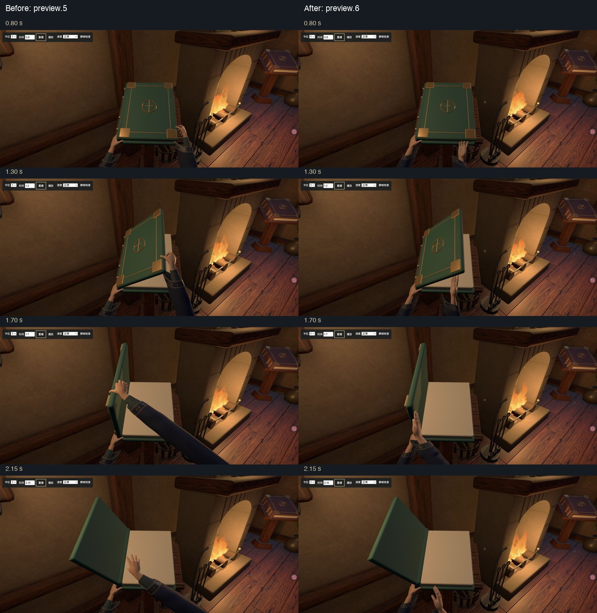
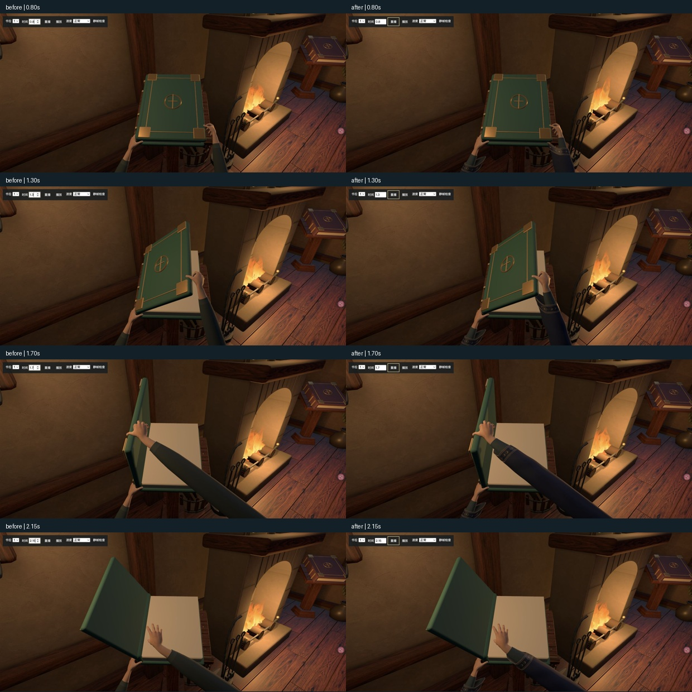
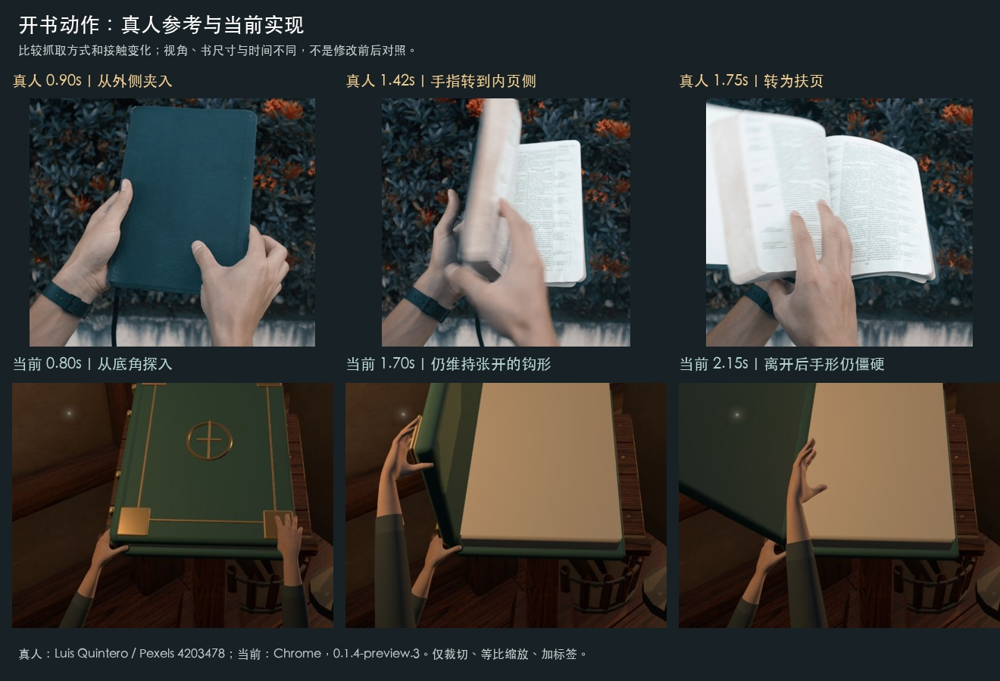
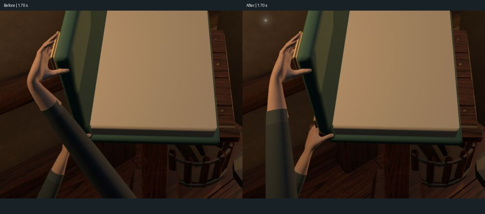

# 大书托举与柔软法袍 — 0.1.4-preview.6

**用户评审更新（2026-09-17）**：用户回复“可以，非常棒”，认可当前版本并授权提交、PR合入主分支及清理本地/远端迭代分支。以下局部视觉判断与限制保留为事实记录，当前验收状态以本条为准；最终保存状态见PLAN。

2026-09-17。**用户否定preview.5的绿色内袖、手形、右手动作和僵硬表面。此前助手视觉通过撤回。** 用户补充书明显大于手，不能照搬小书姿态；本轮按大书下沿支撑重新适配，已完成局部修正和Chrome复核，待用户评审。

绿色/青灰内袖已移除；右手改下沿指腹托举、收拢拇指并在脱离后转掌。腕/掌/指根体积及腱线重塑、肤色噪声减弱、局部体积随指节变化。袍袖改斜垂下片和宽褶，加入烘焙的重力/惯性随动。Bowdoin大开本真人参考验证了大幅页张支撑的方向，没有核实从闭合状态抬厚封面的完整真人动作，不把项目适配称作动捕。

助手查看正侧面各5姿态、五位各4姿态、正常23帧/慢放118帧/真实入口98帧及联系表，认为大书托举关系更清楚、C爪消失，未见明显穿板、大幅悬空或袖片穿掌。主视1.70秒两腕遮挡在侧视可分辨前后关系。仍有撤手指组略直、袖口翻边偏挺和材质细腻度不足；本轮只确认可见改善，不代用户宣布自然度达标。

第一位真实进入《星海余烬》并返回，其他位用检查页。14项测试与构建通过，来源/manifest/public产物一致，三页面错误0。最终GLB3.84MB、73,680三角形、90关节及10个皮肤形态；手形态仅位置增量，部分指组变化很小；布骨不是完整布料碰撞模拟。没有严格性能对照。房间/书本/火焰/布局不变。

详见[本轮实施记录](design/iterations/14-soft-mage-and-large-folio.md)与[证据说明](evidence/v014-soft-mage/README.md)。仍在`codex/midnight-mage-hands`未提交/推送，Chrome主入口原5书和第一位1.70秒评审页保持。以下为历史，被否定版本不恢复通过状态。

---

# 午夜蓝法师手部与袍袖 — 0.1.4-preview.5（随后被用户否定）

2026-09-17。用户选定round-07第二张并授权继续建模。**已完成实际模型与Chrome自检，待用户评审；不宣称概念图精度已完全还原。**

手腕/掌部体积、手指根部过渡、关节浅纹与指甲表面改善；新增青灰贴身内袖、午夜蓝斜垂外袍、真实边厚与内衬、星月织锦边。保留原MakeHuman基础与19.5cm手长，未重做开书动作。已修正首版灰色强反光、波纹管式褶皱和松宽袖口。

Chrome五位四姿态、四个侧视姿态、正常/慢放/正式入口过程及全景已检查；第一位真实进入《星海余烬》并返回，其他位使用检查页。助手未见明显新增穿皮、袖片遮住主要手指或衣袖脱离手臂；外袍开口仍略硬，皮肤与布褶细腻程度低于已选概念，这些是当前造型限制。外袖没有布料模拟；截图采样不是均匀帧率视频。首次seek未稳定导致的旧画面截图已经重采，最终联系表以校正后的图为准。

106帧×42骨骼姿态与旧版差0。14项测试、构建、来源/manifest/生产产物一致性通过，最终三页面错误0。手部GLB为3.77MB、65,104三角形，组合预算4MB；没有严格性能前后对照。所有运行组件、房间/书本/火焰及场景纹理保持。

详见[实施记录](design/iterations/13-midnight-mage-implementation.md)与[实际证据](evidence/v014-midnight-mage/README.md)。Chrome主页面保留原5书全景，检查页第一位1.70秒可重播。当前分支`codex/midnight-mage-hands`未提交/推送；以下为已保存基线与历史评审。

---

# 人体尺寸与侧边夹持 — 0.1.4-preview.4

2026-09-17。用户授权执行真人动作研究方向，另要求按1.70米人物改进过小的手与过细的手臂。**助手认为这轮局部修改比preview.3明显改善，已完成Chrome视觉自检；用户随后认可，并已通过[PR #2](https://github.com/FrankQDWang/StoryOS-blender/pull/2)保存到本地/远端同步的main。**

手长统一19.5cm，修复第三到第五位原本缩到16cm的问题；衣袖截面加厚。右手改为侧边夹持、随抬起改变掌面与指节、由右侧伸入，松手后放松并向右下收回。主/侧视、五书位、正常37帧、慢放47帧及实际入口98帧都已查看；第一位真实进入《星海余烬》并返回。中间候选的侧面悬指没有通过，继续校正后才保留最终版本。

14项测试与构建通过，来源/产物校验通过；GLB 1,226,612 bytes、42关节，未新增运行时IK或依赖。初期骨骼查找错误已修复，最终验证时间窗内错误0。未做严格性能对照；完整肩肘人体、左手动态受力仍未实现，不把局部改善或技术通过视为整个动作已完成。详细尺寸依据、实测与验收边界见[本轮记录](design/iterations/10-human-scale-and-side-grip.md)。房间/火焰保持；迭代分支已清理，两端只保留main。保存前再次通过14项测试、构建和资产校验，64份代码/脚本/资产与认可版本逐字节一致；证据见`evidence/v014-human-save/`，交接见PLAN。以下为历史。

---

# 用户反馈后追加真人动作调研 — 2026-09-17

**preview.3的手部自然度未通过。** 用户认为局部比此前好，但特别指出上面那只手仍然不是人类动作，随后要求“多做一些调研”。右腕折角测量和13项测试不能覆盖这个否定。

本轮实际查看5段真人视频、当前3个握持采样姿态和免费动作数据/视频追踪工具。结果见[真人动作研究](design/iterations/09-human-opening-reference-study.md)及[数据与工具核查](design/reference-library/ready-made-hands/real-motion-data-research.md)。主参考支持保留左扶右开，先改从外侧夹入的接触关系，再决定掌面、腕和手臂方向；不是继续只修一个肘点。

本轮没有修改运行资产或动画，没有新效果可宣称验收通过。研究图仅真实片段抽帧、Chrome截图、裁切与等比排版；三份Pexels参考按其内容许可用于研究，两份作者水印预览仅保存在忽略下载目录。当前GLB/源模型/生成器与本轮起点备份一致，版本仍preview.3。没有新安装、付费或登录，也没有提交/push。以下保留上一轮实施和验证的历史记录。

---

# 逐点动作改进一：右腕/前臂 — 0.1.4-preview.3

2026-09-17。用户明确允许一次只改一个点。**助手判断本轮抬封面时的右腕折弯比preview.2明显减轻，可以交付用户比较；不宣称整体动作已经自然。**

变化仅在`build_makehuman_hands.py`的右前臂辅助肘点：随抬封面抬高并内移，以平滑权重过渡到回收。手腕及手指的世界姿态、接触位置、左手、共享时序保持，没有改房间和火焰。模型与材质继续使用已记录的CC0资产，没有下载新素材。

- Chrome同视角0.80/1.30/1.70/2.15秒前后比较，折腕最重时掌背到前臂的突兀拐角减轻，前臂不再大幅斜跨在左手前面；手的书边位置没有跟着偏移。正常速度、四分之一速度与正式入口的连续关键帧已目视检查，未见此次引入的入场或回落突跳。证据为`comparison-four-poses.jpg`及`normal/slow/live-contact-sheet.jpg`，原图及捕获时间索引保留。截图采样间隔不均匀，不作为逐帧录像。
- 五书位各1.70/2.15秒姿态检查通过本轮目标；第一位《星海余烬》实际完整开书/进入/返回通过。其他书位仅检查页姿态，本轮没有重复全部业务流程或漫游验收。两页面最终捕获错误各0条。
- 新增实际运行GLB姿态回归检查：旧版在1.07秒超过45°设计回归界限失败，新版通过；该界限是本次抬封面动作的回归约束，不是生理限值。1.70秒前臂—掌长轴角由63.47°变为21.75°，0.8–2.1秒阶段峰值从63.68°变为38.28°。源文件106帧对照显示其他骨骼世界矩阵最大差5.4e-7，左右手的原有接触和手指姿态保持。
- 13项测试、生产构建、13份public产物一致、15项manifest与7项来源文件哈希通过；旧大JS分块提示保持。GLB体积仍1,225,908 bytes、28,064三角形、42关节，网格属性/材质/蒙皮权重/图集保持；没有进行性能对照，因此不作FPS提升或跨设备承诺。
- 仍存在：手指夹持关系弱、松手后C形抓空气、左手变化少、回收节奏和自动翻页的表现选择。前臂此次更跟随手走，但尚未建立完整肩肘链；这些均保留为后续小步迭代。

记录与可复查脚本在`evidence/v014-wrist-step/`。浏览器主页面返回原3书全景，最近《星海余烬》，低动态关闭；动作检查页停在第一书位1.70秒、正常速度。当前分支未提交/推送，main仍为`e8bd23e`。下面保留既往判断与被纠正记录。

---

# 免费现成手部替换 — 0.1.4-preview.2

**保存后复查更新（2026-09-17）**：用户指出动作仍然诡异，重新进行观察与讨论。Chrome正式入口、慢放及定点复查确认右腕弯折、接触关系不清、松手仍呈C形悬空与撤手僵硬；此前“动作可信”的助手判断过宽。已保存版本仍为改进基线，本轮未实施新动作。新证据和建议见[开书动作复查](design/iterations/08-opening-motion-audit.md)；以下为此前实现与验收历史。

2026-09-17。**本轮助手视觉自检满意；用户随后确认“已经改善了很多”，认可此版并授权提交、push、PR合入及分支清理。** preview.1 自制手部被否定的记录继续有效，下面的旧通过结论不恢复。当前已换成 CC0 MakeHuman/MPFB 人体的真实手形、原始权重及 CC0 Mindfront Aksel 皮肤，开书动作由项目重新适配，不是现成动作包或真人动捕。

## 实现与来源

- 固定 MPFB 源码提交 `817587ceb2ea03ea17a5b47e04396cbb4ddfa2d5`；原模型/贴图、许可、宏观参数和生成中间文件在 `assets/vendor/makehuman/`。免费，无登录、购买或全局插件安装。下载在项目 `downloads/`，基础导入仅在隔离的Blender进程注册MPFB。
- 保留现成人体的手指、指甲、拇指拓扑和权重，烘焙宏观形变、删除辅助体及多余身体、一次细分；为原有大书道具适配比例，加袖口和前臂控制。原皮肤重新排入1K手部图集。
- `makehuman-hands.glb`：1,225,908 bytes、28,064三角形、4网格、3材质、6图元、2蒙皮/42关节、1个3.5秒动作片段。源 `.blend`、atlas、来源/哈希和可重复脚本已保存；`npm run assets:hands` 实跑通过。
- `opening-sequence.json` 统一离线动作和在线封面/书页时序。左手支撑书身，右手接近书角、抬封面、松开并退回；前臂朝向与腕部朝向分开，并分担旋转。无网页端人体生成、实时物理或IK求解。
- 火焰及房间本轮未改。房间、书本GLB和7份原纹理均与上轮manifest哈希一致；五书位、桌子、碰撞及Quick Access继续保留。旧自制手源文件保留为失败实验历史，不再由当前入口加载。

## 视觉检查与修正

证据目录：`evidence/v014-free-hands/`。截图来自Chrome；拼图仅等比缩放/裁切加时间标签，没有修饰场景。时间来自检查页控件/捕获耗时，是近似截帧标记。

| 发现 | 修正与实际复核 |
| --- | --- |
| 静态袖子穿出皮肤 | 缩短被袖子遮住的皮肤裁切段；`01-source-anatomy.png`中轮廓、指甲及袖口目视通过 |
| 手太小，指尖埋入封面，左右手缺乏分工 | 按大书道具适配尺寸；重调手腕与指节，左手改为书身边缘支撑，右手减少过度弯曲；`03-five-slots.jpg`和原始15帧逐项检查 |
| 松手前形状像抓空气、腕部扭转集中 | 食指/中指贴近书角，拇指靠住边缘；前臂分担旋转，抬起、松手、回收分段；`04-slow-contact-review.jpg`连续21帧检查 |
| 入场起初出现孤立袖子 | 前臂近端随接近和退出一起移动，避免手腕越过近端后袖子反向朝进画面；最终慢放前两帧与0.1秒静帧复核通过，失败帧保留在`slow-before-entry-fix*` |
| 检查页正常但正式入口手不动 | React StrictMode重复挂载时清理停止动作，setup没有重启；把启动/停止配对放回effect，并支持从片段末尾回放。实际第一/第三书位重新打开通过；失败现场在`live-before-lifecycle-fix*`，最终第一书位在`05-live-opening.jpg` |
| 检查页静帧持续占用GPU | 静帧使用按需渲染，调整时间后触发重绘，正常/慢放/性能采样时连续渲染；不改变正式入口的渲染方式 |

最终正常速度17帧、四分之一速度21帧、五书位各0.8/1.55/2.15秒、正式入口两个书位均已查看。关键视角中未见此前的分节拼装手形、孤立袖口、明显封面穿插或整条胳膊翻过去的现象；握住、抬起、释放、收回可以读懂，手指轮廓与关节比例可信。`06-overview.png`保留认可的房间构图。这里是助手对样片的视觉判断，不等于所有机位的精确几何碰撞证明；用户后续的实际认可已单独记于本节开头。

## 功能、构建与边界

- 正式入口：第一台《星海余烬》和第三台《寄往风中的信》完整开书、进入身份正确、返回通过；第二台《守月人》跳过通过；减少动态直接进入、搜索直达和返回通过。原3本作品保留；最近作品恢复为本轮开始所见的《寄往风中的信》，减少动态关闭。未新增/删除项目。
- 第四/第五台在独立检查页验证三种姿态，没有将其宣称为用户真实项目进入；没有重测全屋浏览器步行或未改的创建流程。
- 12项测试通过；包括书页不越过封面、两手权重归一、关节覆盖、烘焙时间长度与1.5MB资产预算。生产构建通过，已有大JS分块提示仍在。
- 13份public文件与生产产物逐字节相同，manifest及来源哈希一致；`production-parity.json` / `preserved-assets.json`。最后主页面及检查页捕获控制台错误各0条；`browser-errors.json`。
- Chrome自然窗口，设备DPR2，Canvas上限1.5；主页面1512×751，检查页曾使用1512×695与751高度。多窗口及截图过程中HUD有约34–71 FPS变化，最终全景捕获48 FPS。没有做同条件旧版性能对照，不宣称性能无退化或跨设备60 FPS；模型的实际体积和复杂度以上述manifest为准。
- 用户认可后，成果`4b00539`已由[PR #1](https://github.com/FrankQDWang/StoryOS-blender/pull/1)合入main；迭代分支本地与远端均已删除，最终交接见PLAN。保存时复跑12项测试及构建，核对资产与生产文件一致，证据在`evidence/v014-save/`。主预览与动作检查页均留在Chrome。窗景/墙面/灯具细化、漫游可见手脚仍未实施。

---

# 开书手部、书页与炉火精修 — 0.1.4-preview.1

2026-09-17。**最新结论：手部视觉验收失败，原自检通过结论撤回。** 用户认为新版手仍不像人、动作不自然并令人恐惧。火焰有改善，按用户要求暂不再调整。现成资源研究已经记录，但没有替换实现，当前预览仍有此问题。

下方保留首轮实施、截图及技术验证历史；其中有关手部造型/动作满意、无剩余严重视觉问题的判断均已被用户反馈推翻。骨骼数、蒙皮有效、帧率及测试通过不能证明自然手形或动作。研究与下一轮连续动作验收要求见 `design/iterations/07-ready-made-hands-research.md`。原房间认可基线和未完成的后续范围保持。

## 视觉真值与实际画面

- 整体方向：`design/round-05/A-hearth-study/final.png`；局部精修保留基线 `db58b4c` / `0.1.3-preview.3` 的实际构图。
- 本轮保留基准：`evidence/design-discussion-20260917/01-overview.png`；最终运行实拍：`evidence/v014-hands-hearth/19-overview-final.png`。
- **全景同框**：`evidence/v014-hands-hearth/comparison-overview.jpg`。两张原图均1512×751，拼接保持原始像素，成图3024×789含38px标题条。CSS视口1512×751，当前画布2268×1126（DPR上限1.5），浏览器截图按CSS像素输出。没有拉伸、替换背景或隐藏正式UI。
- **局部同框**：`comparison-hands.jpg` 与 `comparison-fire.jpg`；旧版由已认可提交在独立临时worktree重新运行，使用相同检查镜头、五本检查书、对应状态。开书均为1.30秒，但新旧动作时序不同，比较造型、接触关系和光照，不声称同一封面角度。
- **五台与真实过程**：`comparison-five-stands.jpg`（5台×0.45/1.30/2.50秒）及全尺寸`pose-*.png`；`07-hands-contact.png`、`09-pages-sequential.png`、`11-slot3-turn.png`、`13-slot5-pages.png`；正式页面连续截图`live-sequence-*.png`与`comparison-live-sequence.jpg`。检查页使用真实场景组件，只冻结观察时间和镜头，不修改作品数据。
- 炉火最终侧面：`14-fire-side.png`；正面火焰/光照检查：`06-fire-refined.png`（此图早于最后的木柴断面前移，最终断面以14及19为准）。已实际打开上述同框图和关键帧检查，不能以文件存在代替目视结论。

## 问题、修正与再验收

| 发现 | 修正 | 复查证据及结论 |
| --- | --- | --- |
| P1 基线手掌/手指拼装感强，双手悬在下沿，不能解释封面如何打开 | 自制连续蒙皮双手，拇指根部、指长和腕部重新塑形；双手32关节，手指微弯；左手稳定、右手沿同一封面时间轴抬起 | 基线/新版同框`comparison-hands.jpg`及五台关键帧；手与封面关系可读，手掌不随书台尺寸任意缩放 |
| P2 初次手模型表面有棱面和不自然的指尖接触 | 造型前细分、体素融合、平滑及网格压减，调整拇指弯曲；避免皮肤自阴影斑块 | 早期01/02与新版07/08/11；轮廓和明暗连续，选择适合原书房的柔和风格化皮肤 |
| P1 开书局部补光在封面和书页上产生刺眼亮斑 | 开书时撤去选中状态点光，沿用房间照明 | 01/02及基线手部图→08/09；纸张与封面颜色可读 |
| P2 三张纸同时翻起像扇子，纸背过蓝 | 改成自上而下错开翻页，积分生成不拉伸的弯曲纸面，微量暖色补足；最终角度与封面保持顺序 | 04→09及五台2.50秒；没有再次出现堆叠扇形、越过封面或反向翻页 |
| P1 基线火芯融成白色块，炉膛有过亮热点 | 保留立体火舌，增加上升噪声、不同频率伸缩，分离外焰与火芯；降低炉内局部灯强度，保留主要暖光 | `comparison-fire.jpg`；正侧面保持体积，层次改善，炉口亮斑收敛 |
| P2 木柴端面平、缺少炭火关系 | 在原木柴坐标添加炭化表层、断面年轮、少量余烬、烟熏和12个微小火星；修正原模型局部缩放造成的端面遮挡 | 05/06→14；端面和裂纹可辨，没有新增大型陈设或遮挡通路 |
| P1 开发中烟熏shader边界出现NaN，后处理放大成黑屏 | 对非整数幂的底数作非负钳制 | 06/14/19及正式流程复验恢复，最终控制台没有shader错误 |

首轮曾判断没有剩余P0/P1/P2，该结论现已撤回。**P1未解决：手掌/手指/拇指造型与动作不可信，给用户带来恐怖感。** “风格化”不能作为降低人体可信度要求的理由；单帧接触可读不代表连续动作自然。下一轮需替换造型基础并重做手与书的接触动画。窗景/灯具等仍为后续工作。

## 五项表面检查

- **字体与排版**：沿用既有字体、大小与层级；正式全景、作品卡、动画标题和工作区实拍没有新增截断。动画标题位于两臂之间，跳过入口可用。开发检查栏只在独立检查页。
- **空间与节奏**：全景、五展示位、书桌/椅子、圆台和地毯位置保持。`preserved-baseline.json`核实布局、原房间GLB、原书本GLB、原房间Blender及烘焙照明均逐字节相同。帧中手书相对位置按每台实际倾角/尺度检查。
- **颜色与光照**：保留暖炉、冷窗和木色。炉火亮度变化为局部有意修正；肤色与青灰袖口融入原色系。对照时火焰、光点相位不同，不能把动态像素差当成布局变化。
- **素材与图像质量**：真实三维房间，新增自制蒙皮手和程序化纸面/炭木，无新图片背景、网络模型或外部贴图。双手源文件及制作脚本独立保存，来源见`assets/source/writer-hands.json`。纹理、绘画等原资产没有被替换。
- **文案与内容**：作品数量仍为原3本，未创建/删除项目。正常访问更新了最近作品，最终为《守月人》；这解释全景对照中最近作品标题的变化。五本检查书只存在于检查页内存中。

## 实际流程与技术验证

- Chrome正式应用：第一/第二台完整开书分别进入《星海余烬》/《守月人》并返回；第三台《寄往风中的信》跳过进入通过。低动态开书直接进入、搜索“守月”直达、继续最近作品、新建表单取消、漫游进入/拖拽环顾/返回均通过。证据为15/16/17、连续动画帧及`flow-*.txt`。
- 五台开书造型与动画关键帧全部检查；本轮没有为原空的第四/第五位创建持久化项目，不能把关键帧检查宣称为五台业务进入的全部实测。碰撞测试仍覆盖五台可达与圆台闭环。未再次浏览器步行全屋；指针锁定继续使用原拖拽降级。
- `npm test`：12/12，包括原10项与纸张顺序/封面边界、双手骨骼及顶点权重有效性两项。`tests.log`。
- `npm run build`通过。`asset-parity.json`验证所有manifest哈希、11份public资源与生产产物一致，检查页HTML未进入生产包。保留既有大JS分块提示。
- 过程中临时对照服务共用Vite缓存导致主入口依赖版本混用；停止对照服务并强制重新预构建后完成全部正式流程。`app-console-history.json`保留原错误；`app-console-final.json`自04:46 UTC重启后仅有既有THREE.Clock弃用警告、错误0条。不能将整个开发历史描述为无错误。

## 资源及性能观察

双手GLB为831,040 bytes，24,796三角形、8个材质primitive、2个skin、每手16关节。未新增贴图或实时阴影灯。当前加载使用新版手；历史旧手GLB仍作为基线资产保存。GLB三角形不等于多次阴影/后处理后的渲染统计。

同机Chrome、1512×751 CSS、DPR上限1.5、五本检查书、相同镜头，每个状态采集5组约2秒窗口。基线为`db58b4c`，只加观察镜头/时间与相同统计；补丁见`baseline-observation.patch`。开书姿态固定在1.30秒，皮肤和纸面更新路径仍运行；环境动态仍运行。以下是五组窗口值范围，不是合并样本的全局分位数：

| 状态 | 基线FPS → 新版FPS | 基线p50 → 新版p50（ms） | 基线p95 → 新版p95（ms） |
| --- | --- | --- | --- |
| 全景 | 57–59 → 57–59 | 16.9–18.0 → 16.8–17.7 | 20.8–22.6 → 21.8–23.3 |
| 第二台开书 | 65–66 → 64–66 | 15.0–15.5 → 15.3–15.6 | 19.0–20.5 → 18.4–21.2 |
| 炉边侧面 | 69–71 → 68–71 | 14.1–15.1 → 14.3–14.9 | 17.4–18.5 → 17.3–19.4 |

数据见`perf-*.json`。本次观察没有明显持续退化；不是跨设备保证、GPU计时或冷启动基准。统计跳过后台和大于200ms的帧，因此不能用它声称没有首次加载/编译停顿。主应用最终全景HUD约59 FPS，4.5秒为本次页面加载记录，不能与旧缓存加载值直接比较。

## 交付检查与边界

- [x] 原认可全景与局部实际截图并排检查。
- [ ] 手部造型与连续开书动作符合人类观感：用户否定，尚未解决。
- [x] 火焰及炭木局部有改善；按用户要求暂不继续调整。
- [x] 五书位关键帧、真实开书及快捷/低动态流程检查。
- [x] 测试、构建、资源一致性、最终控制台及交接记录。

预览`http://127.0.0.1:4173/`保留正常全景，减少动态已恢复关闭，原3本作品保留。本轮工作在`codex/hands-and-hearth-polish`，未提交、推送或改变main/标签；独立StoryOS未修改。临时基线观察服务已停止，证据保留。后续按原顺序处理窗景/材质，再接入漫游身体，不能把本轮手部资产完成等同于已具备漫游手脚。

final result: failed — hands rejected; replacement pending

---

# 右侧书台局部协调 — 0.1.3-preview.3

2026-09-16。用户授权修正三台侧面比例、书桌与最近台过近、中台与最右台过远，同时保住已认可的正面构图。已实现并完成本轮自检；2026-09-17用户已实际评审并正式认可，授权保存到main。此前A图重建记录原样保留于 `evidence/v013-side-balance/design-qa-before.md`。

## 输入与对照

- 已认可正面：`evidence/v013-side-balance/01-front-before.jpg`，来自保存点 `c03e1b9` / preview.2。
- 用户侧面照片：`evidence/v013-side-review/01-user-side.jpg`，用于确认具体问题；不是精确标定相机。
- 同机位侧面前后：`02-side-before.jpg` / `03-side-after.jpg`；正面后图：`04-front-after.jpg`。以上均在Chrome 1512×751正常视口拍摄，无拉伸，无隐藏产品UI。
- 同框对照：`comparison-front.jpg` / `comparison-side.jpg`，3024×799（48px标题条），两侧截图保持原始像素。全景、三台和书桌邻近处均已并排查看。
- 为复现侧面使用临时开发相机：位置[-0.35,1.7,-1.3]，注视[3.8,1.1,-0.5]，FOV53°。参数与补丁保留为 `review-camera.json` / `.patch`；验证完成后移除，正式 `Scene.jsx` 与HEAD逐字节相同。侧面截图不冒充实际步行记录。

## 发现、修正、复查

| 问题 | 本轮修正 | 视觉及尺度结果 |
| --- | --- | --- |
| P2 三台侧面体量不统一 | 台面尺度统一0.72，底座/支柱尺度统一0.87，倾角统一31.5°；各台水平朝向保持 | 三台成为同一套结构；正常近大远小仍存在。书本与手外层同步，不改内部形体和动作 |
| P2 蓝书台与书桌挤靠 | 蓝书台沿右墙向入口移40.6cm | 侧面椅背与台沿之间留白明显增加；书桌、椅子位置和尺寸完全不变。正面蓝书台略右移、台面略变陡 |
| P2 中台至最右台间隔过大 | 中台向入口移64.2cm并内收36.1cm；最右台向中台移26.5cm并向墙侧移18.1cm | 中心距由1.62m/2.77m变为1.79m/1.76m，侧面节奏均衡；横向补偿保留正面的大致投影位置。中心距不是边缘净宽 |

正面夜窗、炉边两台、书桌、圆台/地毯和建筑轮廓保持。三台倾角、体量和遮挡有局部变化，不声称正面逐像素不变。五书位同时占用后仍可辨识和选择（07）。本轮未发现继续阻断交付的P0/P1/P2问题；自检不代替用户评价。

## 五项表面复查

- **字体与排版**：未改UI。正面、蓝书信息卡及两处开书标题均无新增遮挡或截断。
- **空间与节奏**：以上三项已通过同机位前后比较；书桌/椅子、左两台、中央通路及入口镜头保持。可走性由碰撞测试独立验证。
- **颜色与光照**：不改材质、光源或风格。家具移动后重新烘焙原照明与局部遮蔽，接触阴影随实际几何更新；没有遗留原书台位置的阴影。
- **图像与素材**：沿用 `design/round-05/A-hearth-study/final.png` 和既有材质来源；无新ImageGen素材。房间仍是可漫游3D；截图仅用作验收证据。
- **文案与内容**：127.0.0.1预览保留原3本示例。localhost独立5本测试数据验证前台，未写入主预览；主预览最近作品因实际开书变为《寄往风中的信》。

## 验证

- `npm test`：10/10；五台正面均可达，身体碰撞/滑动和圆台闭环通过。`tests.log`。
- `geometry-check.json`：保存的Blender源文件、家具包络、台面与布局通过。Book30网格/1976顶点、Hands14网格/1700顶点相对baseline最大差0；未放宽误差限。
- `camera-clearance.json`：5台接近/聚焦/开书落点均可走，均不需要水平安全修正。
- Chrome：蓝书直接点选和完整开书进入《寄往风中的信》并返回（05/06）；第五台直接点选、完整开书进入《朝向验证·右前》（08/09）；五台占用同框（07）；最终主预览全景（10）。手、封面、书页在开书截图中完整可见。
- `npm run build`通过；`asset-parity.json`检查11份生产资源与源文件相同、manifest哈希正确、scene布局一致、几何证据哈希相符；Book/Hands GLB与HEAD逐字节相同。3份GLB共23,419,356 bytes，房间150,034三角形。
- `console-errors.json`捕获错误日志为空。既有大JS分块和THREE.Clock弃用提示不在本轮更改范围。
- 本轮不重复宣称全屋浏览器步行或未改的创建/Quick Access已重新实测。通路验证来自运动函数；既有指针锁定拒绝时拖拽降级的边界沿用。

## 交付

正式代码已移除临时侧视检查相机。Chrome恢复 `http://127.0.0.1:4173/`、1512×751自然视口、3本示例、全景。最后截图HUD62 FPS、加载3.1秒，属本机开发态观察，不作性能基准。

布局、生成资产、烘焙来源、对照、验证日志均在本项目。上述验证完成时处于 `iteration/next` 未提交工作区；2026-09-17用户已授权合入并同步main及清理迭代分支，最终结果见PLAN.md。2026-09-17用户审美验收通过，随后保存同步状态见PLAN.md；原手部接触细节、概念图与真实模型的植物/灯具/火焰微细差异及桌面Chrome范围不变。

final result: passed
