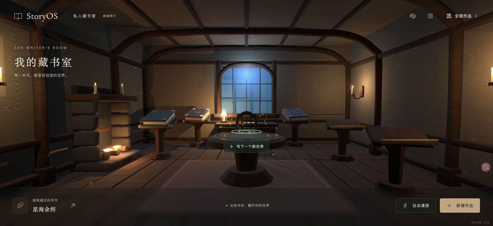
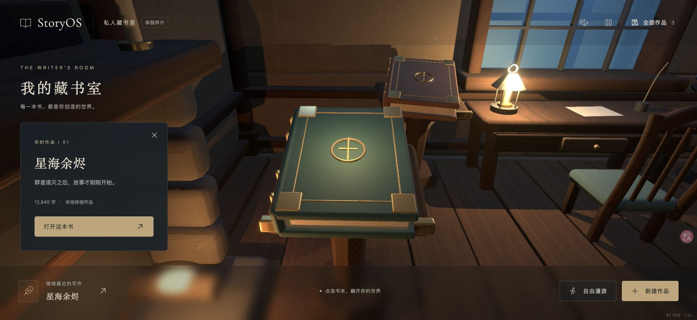
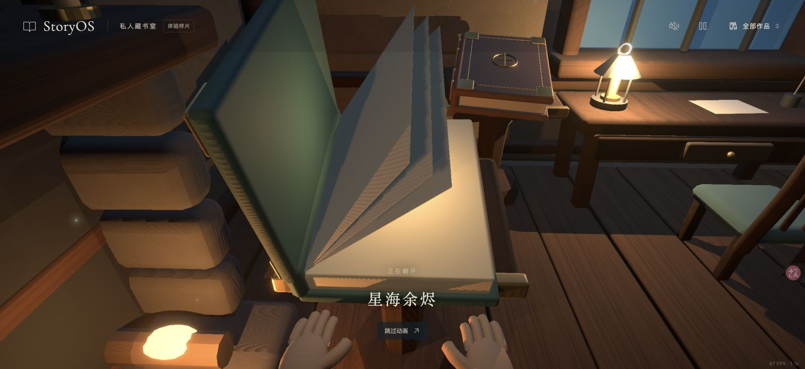

# 第一轮 baseline 调整讨论：更像日常居住的私人空间

日期：2026-09-13。基于 `v0.1.0-baseline`；当前分支 `iteration/next`。
状态：讨论与反馈记录，尚未修改应用代码、Blender 场景或导出资产。

## 用户明确要求

- 整体光影和设计风格仍然认可，保留为起点。
- 现有房间过于对称、规整；用户希望像私人卧室那样自然、随意，书本本身可以规整摆放。
- 不喜欢一本书配一个独立阅读台的陈列方式。这覆盖原方案的独立阅读台要求；五个稳定可见作品位置的产品功能可保留，但家具承载方式待设计。
- 希望空间更紧凑、局部更密集，保留一些可信的生活凌乱。此前“低密度”不能再解释为全屋均匀稀疏、每件物品单独摆开；仍避免无目的堆满物件。
- 壁炉有明显的块状分裂、上下脱节观感，需要修复结构。
- 认可固定的手部开书动作；模型粗糙、手书穿模需要处理。此反馈没有要求改用自由物理抓取或 IK。

S11/S12 是主要环境参考；S19 仍只借指定背乐器角色的造型，不扩大为屏风或全画面陈设参考。

## 当前画面核对

本轮重新操作 Chrome 的 4173 预览，拍摄全景、书本近景、开书状态，并打开保存图片确认内容；同一图像输入中比较了 S11/S12/S19 与当前全景。

1. **全景 / 结构功能可用，生活感不足。**
   - 窗、书桌、椅子、魔法圆桌和地毯强调同一中轴；等高、重复的独立阅读台产生陈列感。
   - 家具彼此分离，桌边和壁炉边缺少成组的使用痕迹。参考图的桌椅/床边/布料更靠近，大小物件有遮挡和疏密变化。
   - 下一轮缩短主要家具间的空隙，将通行空间组织在家具之间，书架、书桌和休息角按使用关系摆放。

   

2. **书本与壁炉近景 / 作品可选，实体结构需要修复。**
   - 壁炉石块圆角与留缝造成明显悬空分层观感；脚本将石块分层建模，没有连续的两侧实体补足圆角缝隙。整体炉口、炉身与炉台应先形成可信连接。
   - 用户描述的所有上下脱节角度尚未逐一复现；已确认当前侧面近景的分块观感，与用户反馈一致。
   - 建议以连续炉体、完整炉膛和过梁为基础，再保留小尺度石缝、磨损和不规则轮廓；不能用增加面数代替结构修复。

   

3. **开书 / 转场可完成，接触关系不可信。**
   - 截图中纸页与封面已翻起，双手仍在书本下方；多个纸页近似硬板同步旋转。
   - `ProjectBook` 与 `OpeningHands` 分别运行变换，手没有与封面接触点一起编排，手/书也使用不同倾角父变换。
   - 截图支持“动作缺少接触”结论；没有据单帧宣称已定位所有穿模时刻，需要后续完整时间轴、近景与侧面检查。
   - 建议以同一套书本、手与镜头编排固定动画，明确靠近、扶住、掀封面、翻页、转场的阶段；降低手指动作复杂度，优先消除可见穿插。

   

附带的交互约束：作品标题和选择仍应有清晰 DOM 反馈，家具靠近后不能让书难以点击；继续保留快捷入口、列表、键盘与减少动态。此次检查没有重新进行完整无障碍审计。

## 助手建议，尚未作为用户决定

- 用紧凑、偏心布局的私人书房组织空间。书籍集中、整齐地放在一组矮书架或柜中，最近读写的一本可放在书桌上；取消五个独立阅读台。
- 写作区稍密：少量正在用的稿纸、墨水、杯子；休息区有椅子/软垫或搭着的布料；壁炉边少量木柴或工具。保留通行区域。具体道具是候选，不是用户逐项确认的清单。
- 将魔法新建融入日常书桌上的装订区域，弱化正中独立仪式圆台；此位置调整仍待讨论。
- 可考虑统一在书桌近景完成固定开书，从书架到桌面用短转场或魔法移动。这有利于稳定手/书接触，但会改变当前“原位开书”，需在空间方案中明确后再实现。
- 先确认一版新的家具关系和构图，再细化壁炉/书/手；修复的验收重点为结构连接、受力与接触，而非仅提高多边形数量。

## 待确认的一项大方向

用户的“像卧室”是生活氛围类比，还是确实希望卧室兼书房、有床？已通过异步问题询问，未收到答复前不把床写成要求。

## 版本边界

`v0.1.0-baseline` 与 `main` 保留。此次只保存反馈、参考比对和截图；不会因为记录了改进建议就认为用户已选择具体家具方案或授权跳过讨论直接重做。
