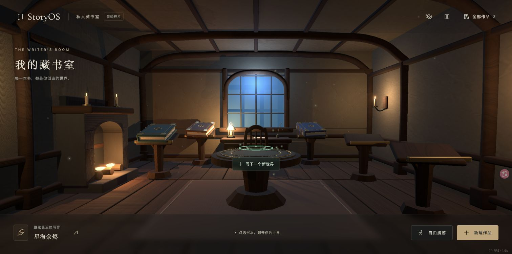
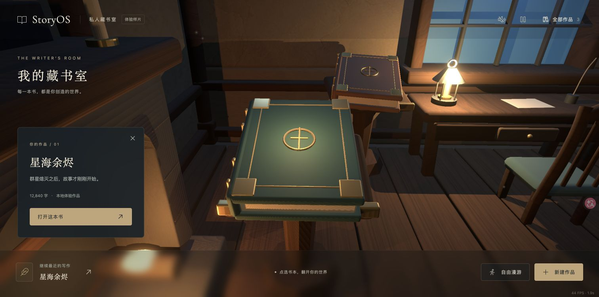

# 恢复第一版，只修复壁炉

日期：2026-09-14。当前预览 `v0.1.1-preview.1`，分支 `iteration/next`。

用户实际体验第二版后要求：“反倒是不如第一个版本，能回滚吗？……第2个版本的壁炉要比第一个强，第一个会有空隙。这个回滚后把第一个的壁炉优化下”。

## 当前范围

- 恢复 baseline 房间、灯光、材质、五个阅读台、中央魔法圆台、UI 和原版固定开书动作。
- 壁炉保持第一版的位置、占地、木台面、蜡烛和木柴；参考第二版的连续炉身与拱口修复结构。
- 两侧石柱连续连接炉台和上沿，拱口填满台面下方；浅石缝保留砌筑感，避免贯穿留缝。
- 不继续上一轮生活感布局。第二版的手部接触改进随整体回退，不能沿用它的接触验收结论。

## 版本与素材

使用新提交记录恢复，保留 `v0.2.0-preview.1`。`main` 和 `v0.1.0-baseline` 不动。修复预览供用户查看后决定下一步。

没有新下载或生成图片，沿用 baseline 木纹/灰泥纹理及来源。场景由 `scripts/build_library.py` 生成，源文件与 GLB 同步保存；前端源文件完全恢复，书本/手部全部源顶点位置与 baseline 一致。

## 实际画面和验证

Chrome 完整开书进入《星海余烬》、返回、中央新建表单与取消通过，仍为原三本作品。4 项领域测试和构建通过。两侧模型 330 条射线抽查由 baseline 16 处漏空降至 0，上沿 25/25 命中，炉膛开放。精确证据与限制见 `../../design-qa.md`。
