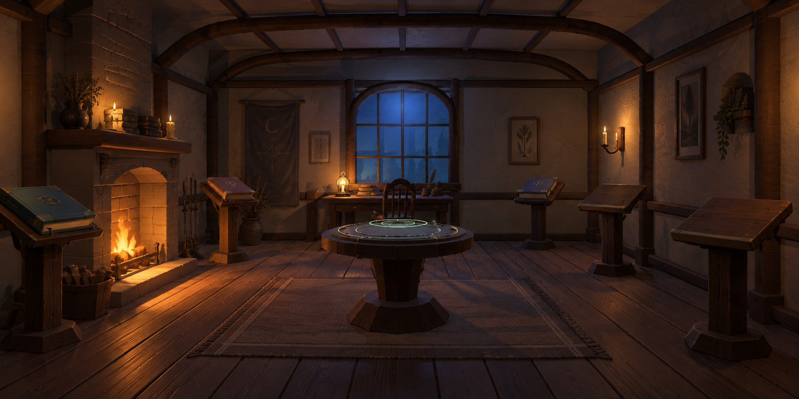

# 第一张确定为整体视觉目标

日期：2026-09-14。继 `02-baseline-hearth.md` 之后的最新审美决定。

用户在第四轮三张实际生成图展示后选择“第一张”，随后补充“太棒了”“就是这个”。

## 所选图片

- 项目路径：`design/round-04/01-open-hearth.png`
- 原工具输出：`/Users/frankqdwang/.codex/generated_images/01a09e7e-1af3-7d11-a67d-cce55541e6c2/exec-f4b2b99a-63ec-4617-b281-1db3e9951a60.png`
- SHA-256：`b6dcb95e6f5f7c78ef85802d7d1aadb700f9b86567690ee293303996c9a8e4c7`
- 实际尺寸：1774 × 887；内置 ImageGen 生成，提示词与参考来源见 `../round-04/manifest.json`。

## 选择的含义

整体画面成为后续视觉目标，保持暖炉光、冷夜窗、木材与灰泥质感、开阔地面及原房间的空间关系。停止扩大风格探索，不再将选图前助手对中轴与规整感的批评视为必须改掉的要求。

此前分项反馈继续解释目标：用户喜欢 T01/T02 的光和感觉，但要求比该网络参考留出更多自由走动空间；T03 空间感可借鉴，配色被否定。当前所选图是这些反馈之后的明确收敛结果。

## 当前实现与后续验证

选型时只记录了视觉选择。随后用户明确回复“好，请开始吧”，已授权并完成在恢复版上的整体视觉实施；当前资产版本为 `0.1.2-preview.1`，尚未新增 Git 标签。所选图仍是目标，不与运行截图混用。

实际截图、同框比较及交互证据在 `evidence/v012/`；测试 10/10、几何检查与生产构建通过。保留可选漫游与 Quick Access；五个独立阅读位正面可达、圆台可闭环绕行。模型、书位和身体碰撞采用同一布局文件。手部动画暂缓，原版源网格逐顶点一致。实施仍在本项目与 `iteration/next` 工作区，未提交或发布，不移动 `main` 或基准/历史标签。细节与限制见 `PLAN.md` 当前交接及 `design-qa.md`。

2026-09-16：前两轮阅读台修正在 `evidence/v012-orientation/` 与 `evidence/v012-rear-inward/`。用户明确否定 `0.1.2-preview.3`，随后批准后排摆正、其余两层平滑过渡的新方案。当前 `0.1.2-preview.4` 已实现后排 yaw 0°、中段内收 10°、前景内收 20°，五台位置及阅读斜面沿用；整体视觉目标仍为本页所选图。实际画面和通过的技术检查在 `evidence/v012-gentle-angles/`。用户看过实际预览后明确表示“可以，这个我比较满意”，授权提交、push 保存本次进度。详情以 `PLAN.md` 当前交接为准。
