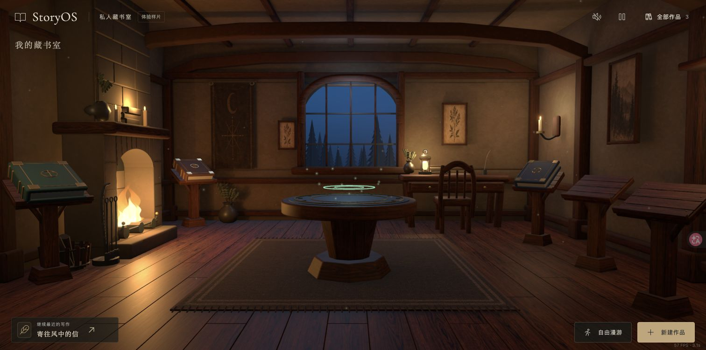
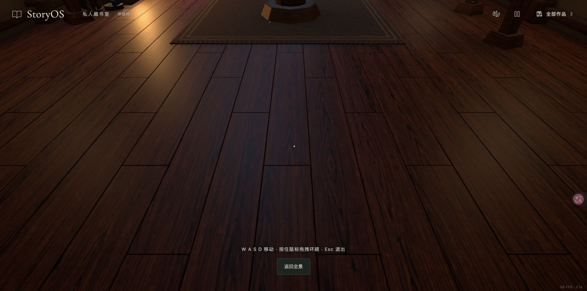
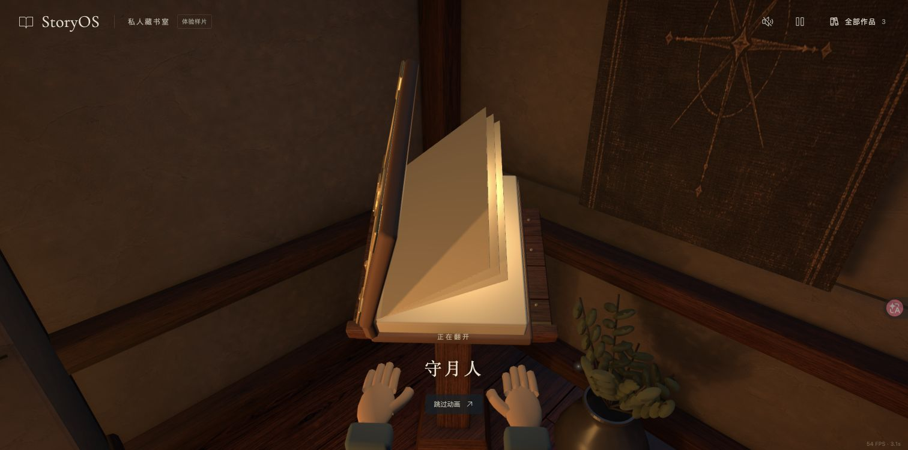
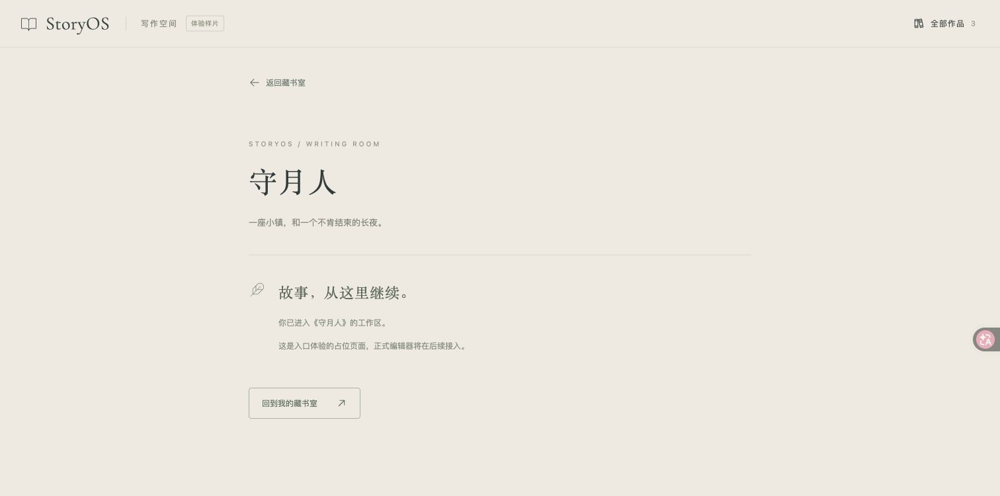

# 基线精修与第一人称身体感：讨论稿

日期：2026-09-17。基线：已认可的 `0.1.3-preview.3`；本轮开始时本地 `main` 为 `db58b4c`，工作区干净。

> 后续状态（2026-09-17）：用户已授权按建议执行。首轮实施开书手部/书页和炉火局部样片，进展与验收以 PLAN.md 当前交接、design-qa.md 为准。以下保留当时讨论和尚未实施阶段的建议。

## 状态与边界

用户满意当前整体设计，希望讨论适量补充元素、火焰/窗边/画作/外景/墙面/灯的精修，以及漫游手脚和开书手部升级。本文件记录建议，不是已采纳设计或实施授权。未修改应用代码、布局、模型、纹理或动画，未安装 skill、生成概念图、提交或推送。

保留已认可的正面构图、五个独立展示位、书桌位置和中央步行空间。可选漫游、Quick Access、全部作品及已有项目流程继续作为前提。旧“保持手部不变”的实施约束仍适用于当前基线；本轮新反馈允许讨论升级，实际替换范围待下一步决定。

用户提到“阳台”；当前代码和画面对应拱窗、深窗台和浅外景，没有可进入阳台。本稿按窗边区域分析，不把新建阳台当作已决定范围。

## 本轮实际观察

Chrome：已有 `http://127.0.0.1:4173/` 标签页，1512×751。

1. **全景：构图成立，细节完成度有差异。** 暖炉、冷窗、中央圆台和左右五台形成清晰层次；中央地面是必要留白。墙面、窗外、灯具和植物近看较简化。

2. **漫游低头：功能可进入，没有可见身体。** 按住鼠标拖拽能够环顾，低头只见地板。当前眼高 1.7m、俯仰限制约 ±64°，WASD 驱动相机及圆形碰撞体。本轮未重新做全屋步行测试；指针锁定未验证，实际使用拖拽降级。

3. **开书：动作触发成功，手与书缺少接触关系。** 截获帧中手在书本下方，手指较直、体块圆柱化，书页像整块硬板抬起。源码也表明没有手指关节运动或手书接触约束。

4. **进入工作区并返回：通过。** 正确进入《守月人》占位工作区后返回全景。这次正常访问更新了样片的最近访问作品；未创建或删除作品。

以上是视觉与局部流程观察，非完整功能或无障碍审计。保留低动态设置、跳过动画及直接进入作品的路径；未来身体和镜头动作不应引入强制晃动。本轮未测读屏、所有键盘路径或其他设备。

## 建议：局部成组补充生活痕迹

- **书桌：** 已有灯、花瓶、墨水瓶、羽毛笔和纸张，优先把这些做清楚；可以补一小叠手稿、压纸物、杯子，合成一个写作痕迹组合。
- **炉边：** 已有柴篮和火钳，优先优化木柴断面、余烬、灰烬和花瓶枝叶；可让一小段植物从炉台边缘垂下。
- **窗边：** 改善窗框、窗台与玻璃的层次，考虑一小盆植物或靠侧收拢的短布帘；避免遮住冷色窗景或增加新焦点。
- **入口背面：** 可候选一个浅壁架、挂钩或挂着的外套，让转身漫游有发现；尚未实拍背面，具体落位要另行检查。

建议先做两到三处小组合。装饰性书册若使用，应无可点击提示且避开五台，避免与项目书混淆。中央圆台周边、地毯边缘和五台接近路径保持清楚。

## 现有元素怎么精修

| 元素 | 当前依据 | 推荐方向 | 制作/运行代价判断 |
| --- | --- | --- | --- |
| 火焰 | 10个封闭曲面火舌、周期摆动、透明材质；当前画面白亮火芯融合明显 | 降低同步感，增加上升、拉伸、消散变化；分清火芯/外焰/余烬，少量火星；炉膛加局部烟熏和炭灰 | 制作中等；限制透明覆盖面积，可维持较小开销，不需要浏览器流体模拟 |
| 拱窗/窗台 | 实体窗框和窗格，窗景较浅 | 改善榫接、边缘、窗台厚度与少量磨损；玻璃轻微反光和色差，保留景物可读性 | 制作低至中；静态结构为主 |
| 画作/挂毯 | 多幅画来自同一装饰图集 | 保持现有题材关系，分别制作合适长宽比的植物画、森林画和挂毯图案；提升画框深度、织物边缘、纹理分辨率分配 | 制作中；纹理显存需控制，不能全部无差别升到4K |
| 外景 | 两层浅空间中的真实树几何加发光夜幕 | 近树、中景林海、远山/天空拉开尺度与明度；近景保留实体视差，远处可用低成本背景层；极慢云层可选 | 制作中；远景不必扩建成可探索地图 |
| 墙面/木材 | 颜色贴图还被用作凹凸贴图 | 使用独立、尺度合适的法线/粗糙度信息；灰泥宽缓起伏，角落和接缝有轻微痕迹；木纹避免过深、过亮 | 制作中；优先材质和烘焙，不靠增加几何噪点 |
| 灯具 | 简化灯笼构件、壁烛；已有实时点光和静态烘焙 | 灯架、灯芯、蜡泪、金属边缘、柔和明暗边界；统一炉火、烛火和夜光关系 | 制作低至中；不为每个装饰新增带阴影实时灯 |

目标是让现有童话三维风格更可信。无需把皮肤、墙面和家具推向照片级写实；轮廓、接触、尺度和明暗通常比纹理噪点更重要。

## 第一人称身体感

当前已经是第一人称相机，新增的是可见身体及其动作。Three.js 支持骨骼蒙皮，不需要换引擎。

| 方案 | 体验 | 工作量 | 判断 |
| --- | --- | --- | --- |
| 仅重做开书手 | 自由漫游仍无身体，交互近景改善 | 中 | 可以独立先做，资产供后续复用 |
| 手臂 + 简化下半身 | 低头看见裤腿/鞋，走路轻微摆臂，开书自然接续 | 中至偏高 | 最适合当前小房间，建议目标 |
| 完整身体系统 | 全身协调、身体影子、脚贴地、更多姿态和衣物动态 | 高 | 增量体验需单独评估，先不作为默认范围 |

推荐实现方式：同一角色风格和手部资产，漫游步行动作与开书关键帧分开制作。下半身留在地面坐标中，随身体朝向而非直接跟随相机俯仰；手臂按第一人称构图处理，并在接近家具时避免穿插。步态根据实际位移同步，以免抵住墙时原地滑步；原地转向、侧移、后退及漫游到开书的接续需要测试。低头范围应配合模型检查，不能只加两只鞋再宣称完成。

平视时手自然处在视野边缘，不强迫持续伸在胸前。减少动态设置保留，镜头晃动默认不增加。

## 开书手部建议

当前 `opening-hands.glb` 为14个网格、3,224个三角形、无骨骼和内嵌动画。制作脚本以椭球手掌、管状手指及袖口拼装；运行时仅整组升起并旋转。问题包含造型与动作，不能只改肤色。

优先使用连续、可变形的手掌和五指结构，改善拇指根部、指长差异、关节轮廓、腕部和袖口。皮肤保持柔和风格，不增加夸张毛孔。可比较适配许可的现成骨骼手与定制造型；尚未选择或下载任何资产。

动作建议：手进入 → 左手稳定书本 → 右手触碰并抬封面 → 书页轻弯并落下 → 进入作品。手和书共同使用一个时间轴，关键帧优先；固定书台可先用预制接触姿态，不需要通用抓取物理。五台尺度/倾角不同，须逐台确认手掌尺寸、接触落点、镜头裁切和穿插，不能把人体随书台任意等比缩放。

## 性能判断与验收建议

本轮读取当前GLB：静态房间150,034三角形、24材质批次/primitive，单本书3,788三角形/30 primitive，双手3,224三角形/14 primitive。GLB统计不等于实时draw calls：书有实例，阴影和后处理会额外渲染。

本轮HUD零散观察约54–66 FPS，1512×751、当前机器、现有缓存和场景；不是标准基准，也不能用于保证添加身体后的帧率。旧3.1秒加载值是页面既有HUD记录，未重新测试冷启动。

初步预算建议而非实测：可见身体先控制在约1–2万三角形、2–4个材质批次、约25–45个骨骼、以1K贴图为起点。骨骼数量按实际动作分配；不要把预算当质量上限或性能保证。合理的合批手部即使增加面数，也未必比当前14个分离网格更慢。

更需注意：透明火焰/烟雾覆盖、阴影、贴图显存和后处理。一个2K RGBA8贴图含完整mipmap约21.3MiB，PNG/JPEG压缩文件大小不能当作显存量；GPU压缩后的情况另算。

实施前建立同机、同视口、同DPR、同书位与同路线的基准；记录全景、炉边近景、低头移动、五台开书的帧时间分布和资源体积。未来可先把新增身体的帧时间增量约1–2ms作为待验证预算，再由实测决定，而非承诺一定达到。静态装饰优先复用材质、合批并烘焙。

## 查到的参考及适用范围

这些外部文件本轮只作研究参考，未安装、未执行其命令，也不宣称运行了完整 Impeccable 审计。

- [Impeccable 项目](https://github.com/pbakaus/impeccable)：当前为统一 `/impeccable` 入口，可按 critique、polish、animate、optimize 等意图工作；重点仍是前端设计。
- [Impeccable polish 原文](https://github.com/pbakaus/impeccable/blob/main/skill/reference/polish.md)：保留既有视觉世界，修正要依据真实画面和路径；自动检测通过不等于质量过关。适合约束这轮基线精修。
- [Impeccable animate 原文](https://github.com/pbakaus/impeccable/blob/main/skill/reference/animate.md)：给动作明确目的、控制重点和预算。适合开书这一主动作及安静的环境次动作；网页转场时长不能直接照搬到手书动作。
- [Anthropic frontend-design 原文](https://github.com/anthropics/skills/blob/main/skills/frontend-design/SKILL.md)：从产品题材做具体选择、尊重已钉住的视觉方向、把表现力集中在少量重点。适合检查通用魔法装饰是否喧宾夺主，不能自动解决3D拓扑和动画。
- [Epic 第一人称渲染文档](https://dev.epicgames.com/documentation/en-us/unreal-engine/first-person-rendering)：提供手臂、腿、世界中身体/影子、视野和穿插的技术分层参考。这里只借概念；Unreal的引擎功能并非Three.js现成功能，也不建议为此换引擎。
- [Three.js SkinnedMesh 文档](https://threejs.org/docs/pages/SkinnedMesh.html)：当前技术栈可以加载和驱动骨骼手/身体。

## 为本项目改写的提示词

以下是本轮原创整理，不是引用某个skill的原文，也不是现在就执行的命令。

### 环境精修评审

> 以已批准的0.1.3-preview.3为视觉基线，担任风格化3D环境美术总监。保留正面构图、五个独立展示位、书桌位置和中央通路。根据真实Chrome全景、侧面和漫游近景，区分需要补充生活痕迹与现有资产完成度不足。仅提出两到三处成组的小物件，逐项说明它们属于谁、为什么放在那里、如何维持焦点、是否影响通行及资源开销。按轮廓、材质尺度、接触、光照、动态顺序评审火焰、拱窗、外景、画作、墙面和灯。先给局部方案与验收画面，不改整体风格。

### 开书动作设计

> 担任第一人称角色动画师。角色风格与当前童话书房一致；连续手部网格、正确拇指和指节、自然袖口。设计左手稳定书本、右手接触封面并抬起、书页柔和落下的一段简短动作；把手指接触点、手腕朝向、封面和书页放在同一时间轴。给出关键姿态和时间安排，逐台检查五个书位的倾角、尺度、裁切与穿插。优先预制骨骼动画，不把通用物理抓取或全身IK当作前提。保留跳过与减少动态。

### 第一人称身体方案

> 在现有Three.js/R3F漫游上增加可见手臂和简化下半身：低头可见裤腿与鞋，走路轻微摆臂，平视保持房间可读性。身体跟随真实位移和水平朝向，头部俯仰独立；避免脚滑、转身扭曲、家具穿插和开书切换跳变。使用与开书一致的角色资产，身体资源按需加载。先确定同机性能基准与资源预算，再比较低头静止、前后侧移、原地转向、抵墙、五台开书和低动态模式；不要用模型成功加载代替体验验收。

## 推荐后续顺序

先做开书手部/书页与炉火两个局部样片，分别建立角色动画和环境动态的质量标准；随后补拱窗外景与材质，再把已确定的手部资产复用于漫游身体。摆件在材质和灯光精修后按剩余空白决定，避免提前堆满。以上顺序尚未由用户采纳。
