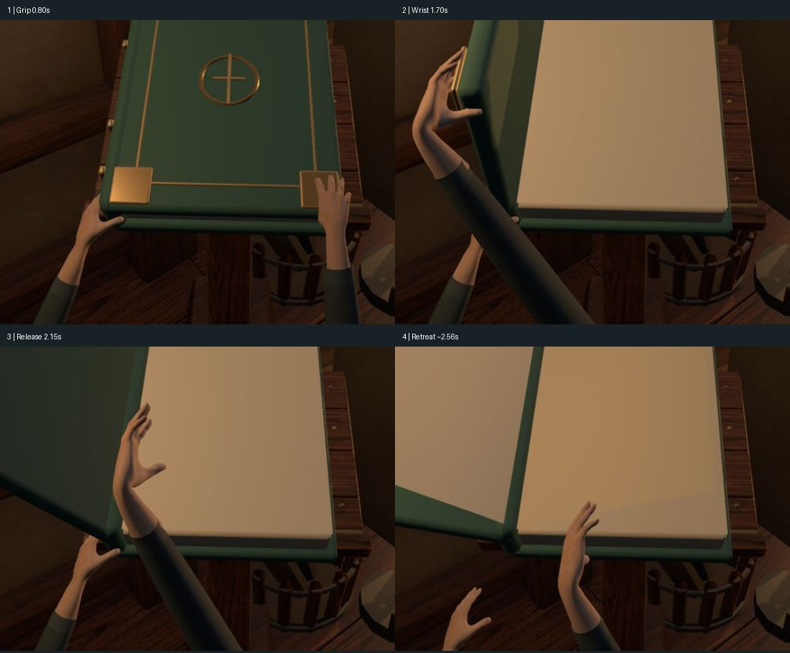

# 开书动作复查：保存后的0.1.4-preview.2

日期：2026-09-17。基线：`e8bd23e`。本轮仅观察与讨论，没有修改运行代码、源模型或动画。

用户认可改善并要求保存后，又明确指出动作仍然诡异，希望先对照双方观察。已保存的进展继续作为基线；“比之前好”不能视作动作已经自然。此次独立复查确认仍有明显问题，上一轮助手的动作满意判断过宽。

## 本次证据

- Chrome现有4173正式页面，第一书位《星海余烬》完整开书两次并返回；第二次连续截图覆盖起手至结束。原3本作品、最近《星海余烬》、低动态关闭保持。
- 检查页第一书位正常速度12张；四分之一速度前段65张、从1.65秒续播后段17张。截图接口延迟不均匀，后段有数秒采集间隔，不作为逐帧录像或速度测量。
- 第一书位0.80/1.70/2.15秒定点截图，第三书位1.70秒复核。没有声称此次重验五位全流程、全部视角或精确几何碰撞。
- 原始PNG、时间索引及联系表在`evidence/v014-motion-audit/`。联系表仅裁切、等比缩放和加标签，原始截图保持；正式入口时间标签是抓取耗时近似值，检查页时间以画面控件为准。
- 已目视查看关键原图、慢放联系表、正式入口联系表与四问题拼图。

## 四阶段观察

| 阶段 | 状态与直接观察 | 改进方向 |
| --- | --- | --- |
| 1. 接近与抓住，约0.3–0.9秒 | 手形比自制版完整，但右手几根手指贴在封面表面；拇指与其余手指如何夹住封面不够清楚。左手钩住左下角后很少变化，双手接近节奏相似。 | 左手先轻扶书身，右手随后找边；明确指腹和拇指的接触位置，留出小幅抓稳与用力的变化。 |
| 2. 抬封面，约1.5–1.9秒 | 最明显的问题。右腕弯成钩状，前臂横跨到左侧并挡住左手，掌面持续跟着封面转。第一/第三检查书位和第一位正式入口都能看到。 | 先确定自然的肘部走向和前臂姿态，再调整腕部；以指端接触为约束，避免把整只手的朝向机械绑定给封面。 |
| 3. 放开，约2.1–2.3秒 | 手已离开封面，仍保持张开的C形悬在书前；缺乏夹持解除与手指放松的明显过程，容易读成抓空气。 | 拇指/指端先解除接触，手掌放松、腕部回正，再沿自然弧线收回；减少无目的悬停。 |
| 4. 撤手和翻页，约2.4–3.3秒 | 双手带着相近手型向下退出，左手也缺乏支撑后卸力的过程。手退出后，书页仍自动逐张翻动，视觉上接近魔法翻页。 | 撤手分先后，左手稍晚离开。先把开封面做自然；是否保留自动翻页作为魔法效果，需要与用户讨论，不能把它宣称为手指翻页。 |

手/前臂相对巨型书本显得偏小偏细，也会放大折腕的观感，但它是次于动作组织的问题。当前截图不足以宣布具体骨骼违反某一生理角度，或证明某一指尖穿插；本次描述的是可重复看到的画面和由此产生的观感。

## 源码支持的原因线索

`scripts/build_makehuman_hands.py:123`附近的`pose()`直接用封面角度旋转右手的位置和腕部朝向，达到近竖直角度后才解除跟随。前臂按辅助肘点朝向手腕，分担一部分旋转，但没有完整的肩—上臂—肘链来约束身体如何完成该姿势。因此，修过前臂扭转并不意味着整个动作已符合人体协作。

手指角度由共同的`grip`系数驱动，食指等关节的额外弯曲量只有0.02–0.05弧度的量级，且固定张指。这个设置与画面中“抓住前后手型相近”的现象一致；接触没有由指腹与书边的关系求解。左腕在退出前基本固定。

`opening-sequence.json`和`opening-motion.mjs`决定封面先抬起、再落向左侧；`pagePose()`独立定时自动翻页。它们共享时钟，但没有表达手指驱动书页。以上是当前实现事实；不需要以购买更贵模型来替代动作修正。

## 建议顺序，待讨论

1. 保留CC0手部网格，选用清楚的真人开书参考，先确定接近、夹边、抬起、放开、回收五个关键姿势。
2. 在离线制作阶段补齐可信的肩肘腕关系与接触约束，再烘焙成现有网页可播放的片段；无需先引入网页实时物理或全身IK。
3. 分别处理手指握紧和放松、两手先后与收回弧线。先验收正常速度，再用慢放查问题，不用单张好看的姿势代替整段动作。
4. 最后讨论自动翻页的魔法表达、手书比例及皮肤质感；第一书位动作可信后再检查其余四位。

此次主页面可见跳过动画，减少动态保持关闭；未重新做键盘/辅助技术或动态敏感性测试，不宣称完整无障碍通过。没有运行代码变更，故未重复构建或测试。

当前建议的优先级是折腕、夹持、松手；等待用户指出自己最不舒服的瞬间后再选下一轮范围。
