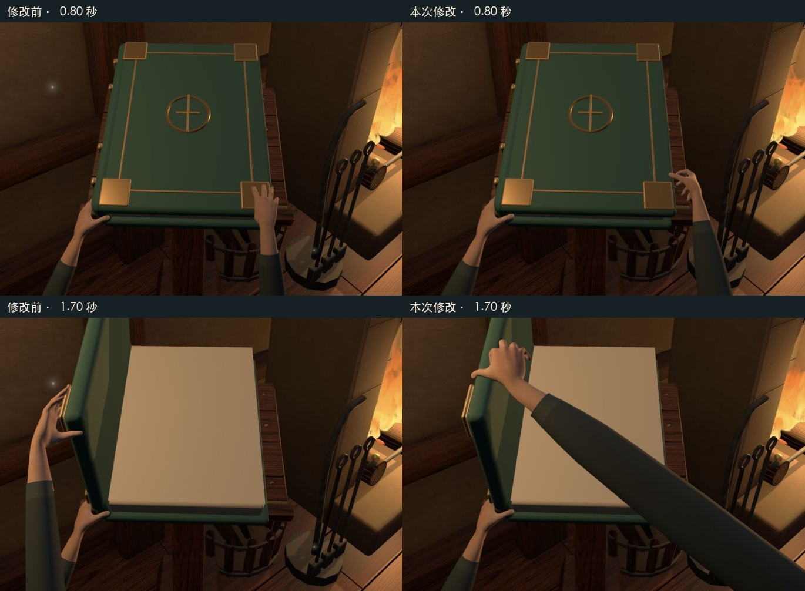

# 1.70 米角色的手部尺寸与侧边夹持

2026-09-17，0.1.4-preview.4。用户授权执行上一轮研究方向，并指出手太小、胳膊太细，要求按1.70米人物估算。本轮保留免费CC0 MakeHuman手形，修改尺寸适配、右手抓取/抬起及必要的释放衔接；助手已完成视觉自检，用户随后认可并授权提交、push、合并和分支清理；不代表完整人体动作最终达标。

## 尺寸依据与实测

[DINBelg 2005 作者人体测量表](https://www.dinbelg.be/DINBelg%202005%20anthropometry%20table.PDF)的18–65岁混合成人样本，身高均值1706mm、手长均值189mm、掌宽均值83mm；手长P5–P95为169–209mm。它提供合理量级，不是“身高170cm必定对应某个手长”的公式。[NASA人体测量团队](https://www.nasa.gov/directorates/esdmd/hhp/anthropometry-and-biomechanics/)也明确说明，相同身高体重的人仍可能有不同身体比例。

本角色选手长**19.5cm**（腕部模型原点至中指最远皮肤顶点），统一保持原始手形比例；掌部指定网格截面约**9.3cm**。后者包含原模型截面轮廓，是制作测量而非严格人体测量标志点。它是偏宽的成人手形；没有照抄视频人物的尺寸，也没有把最初口头提出的8.5cm当成最终实测值。

实际问题是`OpeningHands`与书共用书位scale。原手在第一/第二位约18.31/18.38cm，在第三到第五位只有16.00cm。同一人体随书缩放。现在模型按参考书位0.824制作，播放时对每个完整蒙皮手臂抵消其他书位的scale，绕拇指末节锚点补位；五书位实测均19.50cm。相对上一版，前两位约增大6%，后三位约22%。数据和只读测量脚本在`evidence/v014-human-scale/dimensions.json`、`measure-scale.py`。

袖子改为更饱满的截面和渐收袖口。距腕约20–33cm的衣袖宽度比同书位旧版增大约25–30%；这是衣袖外轮廓，不能当成裸前臂围度。远端袖管仍是为当前镜头制作的延伸代理，本轮没有完整肩—上臂—肘骨架；因此不能宣称已经构建了完整1.70米人体。已有聚焦镜头仍是电影式俯视机位，没有把它改成真实1.60米眼高。书本仍是72–82.7cm长的巨型道具，保留用户认可的书台与构图。

## 动作变化

- 保留左扶右开，右手从外侧接近封面。拇指外侧指腹目标决定手腕位置，不再先把腕钉在书角再补肘点。
- 抓稳、半开和高位采用不同掌面和指节姿势。高位中指转到封面内侧，食指沿边，拇指留在外侧；不把同一个C形抓姿整体旋转到底。
- 右前臂从画面右侧伸入，抬起时调整旋转与方向，减轻此前“右手从左侧长出”的感觉。
- 松手后各指放松，向下、向右撤出，不再在书页前保持夹持姿势停留。总时长仍3.5秒，封面/纸页共享时间轴未改。

真人动作主参考仍是[Luis Quintero/Pexels 4203478](https://www.pexels.com/video/a-person-opening-a-book-4203478/)，原始帧路径在上一轮`09-human-opening-reference-study.md`。没有下载新模型或动作资产，无ImageGen生成图。源网格、纹理许可仍见`assets/vendor/makehuman/README.md`。

制作中做过局部指节端点拟合以辅助选择高位姿势，结果再经主/侧视截图筛选；最终姿态直接记录在生成器中，重建不需要拟合工具。`contact-samples.json`读取最终源模型，证明拇指目标与指节变化；骨骼末端不是皮肤碰撞面，不能据此声称所有指腹精确接触或具备真实受力。

## 视觉验收

实际Chrome截图保存在`evidence/v014-human-scale/`：

- 同视角0.80/1.30/1.70/2.15/2.60秒；对照图使用前一轮preview.3真实截图，裁切、等比展示、加标签，没有生成或修饰手部像素。
- 第一位侧面0.80/1.30/1.70秒，用于检查拇指与指组位置。中间候选正面看似改善但侧面悬指，被否定后继续修改；`trials/candidate-*`是中间状态，不是验收最终图。
- 正常速度37帧、四分之一速度47帧，联系表逐图检查。联系表标签为捕获经过的墙钟时间，不当精确动画时间；原截图保留检查页时间读数。
- 五位各四个关键姿态，见`five-slots.jpg`。第一位真实开书98帧、进入《星海余烬》并返回；其余四位是检查页验证，不宣称真实作品进入。
- 全景构图、原3个作品、最近《星海余烬》、低动态关闭保持。房间、书本、火焰、布局、共享时间轴、7份场景纹理与保存main逐字节相同。

助手判断：当前右手高位轮廓、接触用途和手臂方向比preview.3明显合理；后三书位人体不再随书缩小，袖管不再过细。这一轮局部改善可以交付。左手支撑仍偏静止，完整肩肘协作、手指细微受力和撤手细节仍可继续优化；自动翻页和漫游身体未改。

## 技术验收与边界

14项测试、生产构建通过。新增测试将实际GLB交给Three的加载器和动画混合器，验证五书位人体长度一致、缩放不移动拇指末节锚点、重复更新不累计放大。旧45°姿态回归范围调整为用户指出的高位1.50–1.90秒；新低位侧夹姿与旧抓法不同，不能沿用旧低位阈值作为人体标准。没有将角度或测试通过当作动作自然的证明。

GLB 1,226,612 bytes、28,016三角形、42关节、4网格、3材质、6 primitives，较上一版仅增加704 bytes。15项manifest资源、8份来源文件及生成器哈希、13份public与生产产物一致性通过。没有新增运行时IK、物理、依赖或付费素材；没有做严格性能前后对照，不能宣布零性能变化。构建原有大分块提示保持。

开发时曾因Three骨骼名称去标点规则导致检查页加载错误，已改用`PropertyBinding.sanitizeNodeName`并由实际GLB测试覆盖。完整历史错误保留在`browser-errors.json`，最终验证时间窗内错误为0。用户已授权保存，成果已由[PR #2](https://github.com/FrankQDWang/StoryOS-blender/pull/2)合入main（成果`e6d033a`、合并`fcaa7d1`）。本地与远端同步且只保留main，历史标签与detached worktree草稿保持；Git交付与保存复核见PLAN及`evidence/v014-human-save/`。
