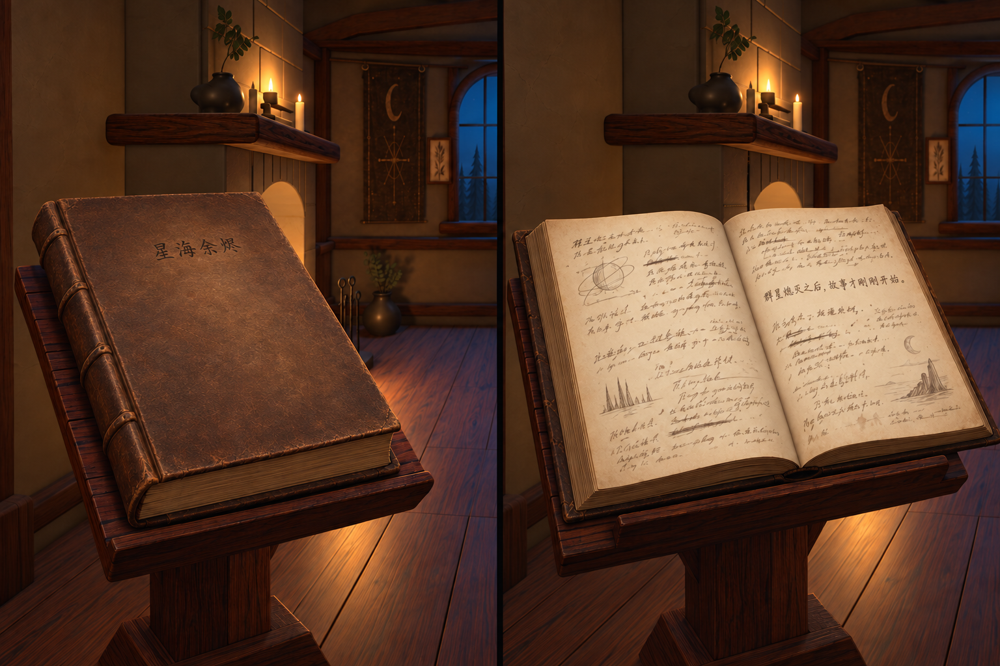

# 已认可的书本素材参考：私人手稿

**2026-09-22，用户已认可整体审美。** 原话：“可以可以，我非常满意，这个非常非常 nice。”

[原尺寸PNG](reference.png)，1536×1024；SHA-256：`c94b3e1cce6eb7c3f31a0875a39fa6ee717383eebfee478cc2d6d4d374e0f429`。与主对话获认可的round-09 v2逐字节一致，无压缩、裁切或重新生成。

## 参考用途

这是同一本《星海余烬》的闭合封面（左）和打开内页（右），是后续书本材质、中文标题、纸墨与私人记录气质的审美基准。保留朴素旧皮、暖纸、自然笔迹、删改和克制的小草图。它仍是概念；书台、房间和书板的生成几何差异不扩展成新改造要求，也不作为运行贴图直接使用。

用户补充：多本书整体风格保持一致，允许材质等细微差别。见[多书差异规则](material-variation-guidance.md)；具体色调/参数示例仍是设计建议。

## 来源与追溯

由内置ImageGen生成，首稿一次、定点修正一次（去规则横线、减轻过重磨损、融入简介墨色）。三张实际输入为项目认可书房全景、现有大书近景，以及Claire Hummel为Riven制作的手写日记参考G。G的[作者原始来源](https://www.tumblr.com/shoomlah/758109023934480384/and-just-because-its-fun-a-bunch-of-my-art-my)只作为纸墨/笔迹气质参照，不复制其作品正文。本目录保存获认可生成图，不收录该第三方参考原图。

- [初次生成提示词](prompts/01-generation.txt)
- [定点修订提示词](prompts/02-refinement.txt)
- [来源、输入输出路径与哈希](provenance.json)

素材已列入项目参考库。3D落地与加载延迟增幅≤10%的实测验收尚未完成。
