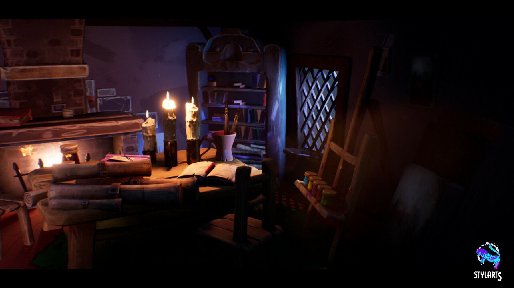
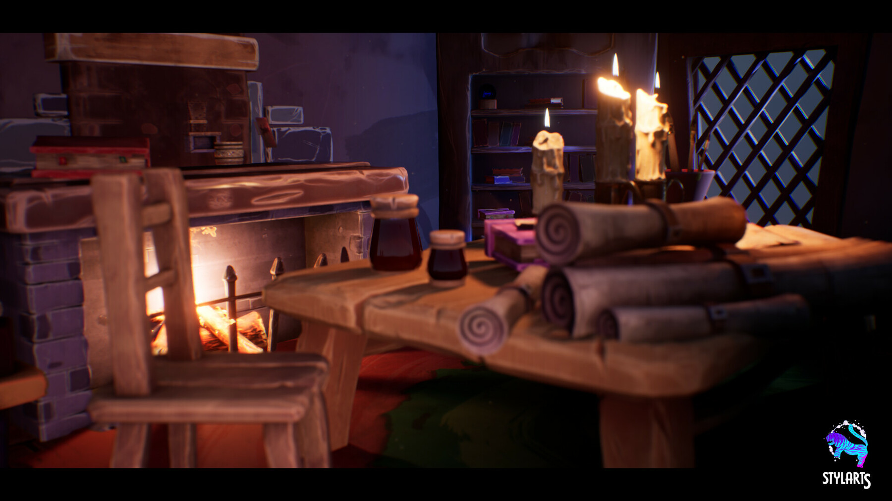
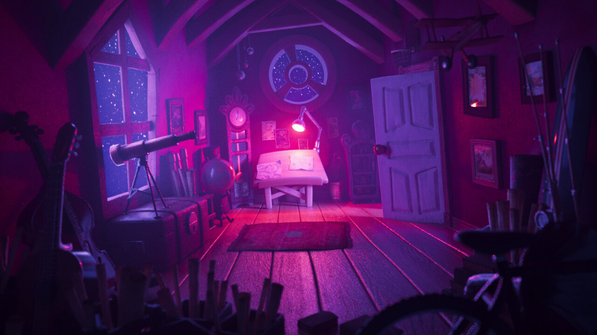

# 整体空间与氛围：基准附近的参考

日期：2026-09-14。状态：已收到分项反馈，继续审美对齐。未实施设计变更。

## 最新用户反馈

原话：“喜欢T01 T02的光和感觉，但是这个布局有点挤，我们是要能自由漫游，就是在房间走动的，需要留出空间。第三张不喜欢配色，但是空间感不错。我们继续对齐审美”。

- T01/T02：光与整体感觉获认可；拥挤布局不采用，必须留出走动空间。
- T03：空间感获认可；配色被否定，不能沿用紫红灯光。
- 上述均为分项选择，不能标记整套家具、全部材质或整屋方案通过。
- 下一轮把已认可的光影和空间感放在同一画面中比较；概念图不能代替自由漫游和实际尺度验收。原始筛选分析保留于下文。

## 本轮需求

用户认可当前 MVP 可继续作为基准，但认为整体太对称、规整；另提出左二右三的平衡问题。此前修改版被回滚，不能直接重启其方案。当前先找可能喜欢的实际参考，手部动画暂缓。

## 已确认与待验证

- 沿用 S11/S12 的整体环境偏好：夜间、魔法/奇幻、有雕塑感的立体童话空间、私人尺度。原来源为 [J. Moretti 场景设计作品集](https://www.jmorettidesign.com/gdt-pinocchio)。床、树洞、宗教符号不是采用要求。
- S19 仅指定角色画风被认可，屏风被否定。S05、S14、S18 以及此前写实方向被否定，不能泛化成所有纸艺、手工或定格作品都合适。
- 当前 Chrome 画面可见正中窗、中央圆台与相近高度的阅读台。这支持“前后层次与主次可作为探索点”的助手判断，不代表用户已经选定偏心布局。
- 左二右三的数量与整体视觉平衡需要分开确认；目前不改变五个稳定展示位，不假设要增加至六个。
- 用户否定 v0.2 整体体验，不等于否定所有生活感家具或不对称构图。

## T01：炉边魔法书房，全景

[Stylized Wizard Room](https://www.artstation.com/marketplace/p/1VOmJ/stylized-wizard-room)，展示页署名环境作者 Horia Mocanu，发布方 StylArts。

助手认为值得比较：炉火、桌面和书架有聚集关系，右侧保留暗部，大小家具形成层次；与当前冷窗、木材、炉火方向接近。待确认的是这种包围感与明暗分配。图中桌面物件比样片需求密集，不将它们自动转成陈设要求。

## T02：同一作品，家具近景

与 T01 是同一个作品，不是独立方案。看桌沿、椅子、卷轴与壁炉的体积概括和略有变化的轮廓，判断用户喜欢这种卡通化程度，还是更靠近 S11/S12 的材质与形体。

## T03：星夜阁楼，空间层次对照

[Attic Lighting Setups — Stylized Night](https://luisborges.artstation.com/projects/v2yBzO)。Luís Borges 负责灯光与大部分布局，概念 Jeremy Vickery，资产 Alex Mateo。

助手认为值得比较：斜屋顶、前景遮挡、侧窗和深处的书桌，使小房间有前后层次。高饱和紫红光明显偏离当前气氛，只作偏好试探；不能因为空间形体获认可就采用色彩、观星器材或更高物件密度。同页其他阳光版本不在本轮范围。

## 已筛掉的候选

- July D《Stylized 3D Witch Cabin》：已在 Chrome 查看全景，石墙纹样、地面亮度与传统游戏美术感更突出，本轮不优先展示。
- Angelo Tsiflas《Witch Hut》：已在 Chrome 查看作品，明显日光且装饰密度较高，不采用为本轮气氛候选。不能将这项助手筛选记为用户否定。
- 搜索中的泛化写实 AI 魔法房、满墙瓶罐、公共学院/神殿画面未选。

## 文件与验证边界

原图从已在 Chrome 显示的公开图片地址保存到 `images/`，未裁切、调色或重新生成。原始 URL、字节数、SHA-256、署名及状态见 `manifest.json`。三张本地图片逐张打开核对，均为对应的 JPEG。

参考图只用于本地视觉讨论，没有购买第三方模型、没有纳入运行场景。当前页面在 Chrome 实时查看；没有重跑功能验收或改动前端/Blender/GLB。保留 `iteration/next`、`main` 与所有历史标签。本轮只更新参考资料和 PLAN 交接。

后续概念研究见 `../../round-04/`；继续基于恢复版对齐空间与气氛，不直接实施第三轮任何参考房间。
