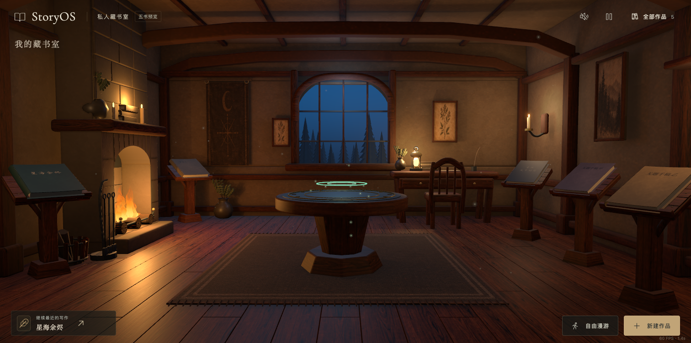
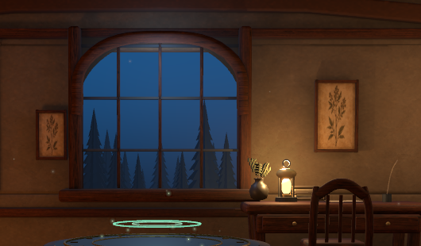

# 窗外景深与窗边细节：技术调研

日期：2026-10-04。阶段：方案研究，未修改运行代码或资产，未测新方案性能。

## 第一推荐

采用**少量近景低面树枝 + 两层中景树影 + 不透明远景背景**。保持已认可的昏暗室内、暖炉与冷窗关系，把提升集中在轮廓、遮挡、远近色差和漫游视差。

近树使用有厚度的少量几何；中景优先使用按树冠轮廓裁形的网格，必要时使用 alphaTest 镂空贴片；远景把森林、淡雾和天空合成一张背景。不把雾做成多层半透明平面。

## 当前画面与推荐美术方向

本轮主工作区为干净 main `2889b4c`，第一项书本成果已经保存。独立无头 Chrome 从现有4173首页捕获五书预览，保持未选中/未悬停和现有灯光；两张截图均已打开检查，未操作用户浏览器或其存储。

实拍判断：窗外树冠轮廓重复且集中在下半窗，上半部主要是平整蓝色，远近层次偏弱。窗框已经有厚度、拱口、竖梃和深窗台，适合精修现有结构。源码 `scripts/build_library.py:215` 显示两排真实树几何（11/13株），深度4.91/5.35，背景板深度5.65；`apps/web/src/Scene.jsx:57` 已有夜空高度渐变。此次不是给完全空白窗口补外景，而是重新组织已有外景的尺度与遮挡。

首推「月夜深林」：近处一两组不规则深色枝干偏置于窗侧；中间树冠错落成组，保留一条看向远处的空隙；远处低对比林线/山脊承接暗蓝天空，薄云以低对比纹理表现。靠空间层次营造幽静奇幻感，维持室内昏暗、暖炉冷窗和书桌位置。窗边首轮只精修窗框接缝、边缘与玻璃微弱反光；已有花瓶与桌灯足够支撑生活感。

分层景物营造纵深的思路可参考[华特迪士尼家族博物馆的多平面摄影机介绍](https://www.waltdisney.org/blog/machine-imagination-walt-disneys-pinocchio-and-multiplane-camera)：前、中、后景位于不同深度，摄影机运动时产生层次。本项目借鉴空间组织，不把房间替换成二维背景；近景仍保留真实几何，远层须经漫游侧视检查。

## 一手资料与技术事实

1. Three.js 的透明对象依赖排序，交叉平面可能出现遮挡错误；官方建议锐利树叶/草边缘可用 alphaTest。它能处理镂空，但不等于零像素开销。[Three.js Transparency](https://threejs.org/manual/pages/transparency.html)
2. 普通常规纹理的显存近似为宽 × 高 × 4 × 1.33（含 mip）；降低 JPG 文件体积不等于降低显存。1024² 约 5.3 MiB，2048² 约 21.3 MiB。这是常规未压缩 GPU 纹理估算，不适用于所有压缩格式。[Three.js Textures](https://threejs.org/manual/pages/textures.html)
3. MeshPhysicalMaterial 的高级效果增加逐像素成本；透射能表现较真实的玻璃，但启用更多效果会继续增加成本，官方建议配合环境贴图。[Three.js MeshPhysicalMaterial](https://threejs.org/docs/pages/MeshPhysicalMaterial.html)
4. 实时环境反射通过 CubeCamera 把场景再次渲染到立方体目标；它不是普通表面的一次取色。[Three.js CubeCamera](https://threejs.org/docs/pages/CubeCamera.html)
5. Unity 官方指出重叠透明元素是 overdraw 的主要来源之一；这个渲染原理也适用于窗后叠放树片，但不能直接把 Unity 的具体性能数字套给本项目。[Unity Graphics performance fundamentals](https://docs.unity.cn/Manual/OptimizingGraphicsPerformance.html)

## 方案比较（以下为针对本项目的工程推断）

| 方案 | 实际收益 | 主要成本与缺点 | 建议 |
|---|---|---|---|
| 近景低面几何 + 分层树影 + 远景底图 | 近处有厚度，横移时前后层相对移动；保留远处丰富度 | 需校准侧视角，避免看穿背景边缘；少量新增网格/纹理 | 首选 |
| 完整 3D 森林 | 大幅走动和多方向观看时更可信 | 更多几何、材质、上传和着色；若树叶仍靠贴片也有 overdraw | 室内窗景用途不划算 |
| 实时玻璃透射 + 反射 + 体积雾 | 玻璃与空气的物理表现更强 | 更复杂着色/额外渲染目标；体积采样增加持续渲染工作 | 本轮不采用 |

这里的“景深”主要指空间层次，而不是镜头景深模糊。不同距离的对象经透视投影自然形成视差；层间距离应由真实漫游视角验证，不用鼠标驱动背景假位移。

## 建议的最小试作

- 先做一个窗口：近层 1–2 个可辨认树干/枝组，中层 2 层不同轮廓，最远层一张不透明天空/林线背景。数量是试作起点，不是性能保证。
- 各层使用同一低饱和冷色系；近层深且清晰，远层略浅且降低对比，雾感直接融进远景色彩。
- 窗框只补真实厚度、边缘倒角与少量接缝；窗台利用现有材质调整粗糙度和局部污渍，优先复用纹理。
- 玻璃先用克制的静态高光/污痕表现存在感；不新增动态反射探针、透射或全屏雾效果。
- 贴图先从一张 1024² 图集试做，按实际窗户屏幕占用与漫游最近距离判断是否够清晰；不直接增加 4K 纹理。

## 10% 约束如何落地

保留此前10%约束对应的固定性能基准，同时留存刚保存版本的正式构建作为本轮直接对照，不把每轮10%自动叠加。使用同一五书数据、Chrome、视口和网络条件，比较冷/暖首页到可交互、首次手部绘制及进入工作区的等待；沿用已有测量脚本与开书/返回主路径冒烟。新增下载字节、纹理像素量、draw calls 和三角形数用于解释原因，不替代加载时间测量。

至少检查首页全景、靠窗近景、漫游左右侧三类画面：没有明显贴片侧面、背景露边或玻璃挡景，再做同条件加载对比。≤10% 是实测门槛；当前研究没有宣称达标。

下一步建议：以当前首页实拍制作单窗局部构图样稿，先确认近/中/远三层与室内亮度的关系，再实现静态版本。微风/云动放在静态效果成立之后判断。本轮只完成调研与截图，没有新方案生成图、运行改动或性能实验。
